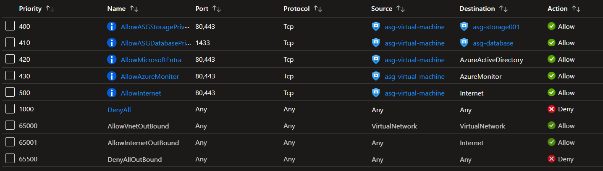

# Azure Private Endpoints security

## Setup

Create the `.auto.tfvars` file and add your public IP:

```sh
cp templates/local.tfvars .auto.tfvars
```

Get your origin IP:

```sh
curl ifconfig.me
```

Set up the required variables:

```terraform
subscription_id           = "00000000-0000-0000-0000-000000000000"
allowed_public_ip_address = "1.2.3.4"
```

Create the temporary keys:

```sh
mkdir .keys && ssh-keygen -f .keys/temp_rsa
```

Create the resources:

```sh
terraform init
terraform apply -auto-approve
```

## Private Endpoints

Protecting outbound traffic by using Application Security Groups (ASG) with Private Endpoints.



> [!IMPORTANT]
> The [documentation][1] defines the following:
> > This setting only applies to private endpoints in the subnet and affects all private endpoints in the subnet. For other resources in the subnet, access is controlled based on security rules in the network security group.

> [!NOTE]
> Network Security Group rules using application security groups may only be applied when the ASGs are associated with network interfaces on the same virtual network.


## Testing

Log into the virtual machine and enable the Azure CLI with the System-Assigned identity:

```sh
az login --identity
```

Attempt to connect to the storages. Storage `001` should work, and storage `002` should fail:

```sh
# This should work
az storage blob list --auth-mode login --account-name <storage001> --container data

# This should fail
az storage blob list --auth-mode login --account-name <storage002> --container data
```

Additionally, test the connectivity to the SQL Database via Private Link.


[1]: https://learn.microsoft.com/en-us/azure/private-link/disable-private-endpoint-network-policy?tabs=network-policy-portal
